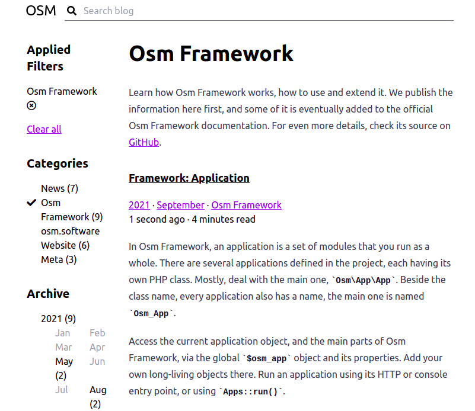
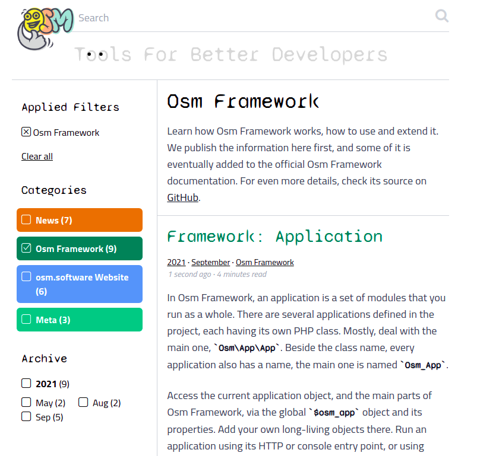

# 2021 Sep 13 - Sep 24

...

More details:

{{ toc }}

### meta.list_text

...

## *osm.software* Website v0.3.0

[Diff](https://github.com/osmphp/osmsoftware-website/compare/v0.2.3...v0.3.0)

### New Visual Look

Yes, the website got the whole new visual look. Compare

with

Better, huh?

From a technical perspective, this effort demonstrates that an Osm Framework-based website can have multiple themes that can be switched with a single change in the settings. For more details, compare the [old](https://github.com/osmphp/osmsoftware-website/tree/HEAD/themes/_front__tailwind) and [new](https://github.com/osmphp/osmsoftware-website/tree/HEAD/themes/_front__my) themes, and check the [`theme` setting](https://github.com/osmphp/osmsoftware-website/blob/HEAD/settings.php), too.  

### New Content

New articles about Osm Framework have been written, and previous articles have been edited and revised:

* [Computed Properties](20-framework-computed-properties.md)
* [Modules](22-framework-modules.md)
* [Dynamic Traits](21-framework-dynamic-traits.md)
* [Application](23-framework-application.md)

### Other Changes

* The project migrated on Osm Framework `^0.12`
* A few bug have been fixed

## Osm Framework v0.12.8

[Diff](https://github.com/osmphp/framework/compare/v0.11.2...v0.12.8)

**Important**. After switching to this major version, apply [these changes](https://github.com/osmphp/project/compare/v0.11.0...v0.12.1) to the project files. Also, update [page templates], and use website-wide [header, footer](#page-layout-changes), [`<head>`](#customizable-head) and [error page](#customizable-error-pages) templates.

### Page Layout Changes

`std-pages::layout` Blade component is now a part of `_base` theme. It means that it can be used in any theme, and contains no Tailwind-specific markup. 

If you use the previous component version, update your page templates, and run `gulp`:

    <x-slot name="header">
        <header class="container mx-auto fixed top-0 left-0 right-0 z-10">
            ... current contents ...
        </header>
        

    </x-slot>

    

        ... current contents ...
    

    <footer class="container mx-auto">
        ... current contents ...
    </footer>

### More Convenient Header And Footer

If the header and footer is the same across the whole website, put them into the `std-pages::header` and `std-pages::footer` templates.

### Customizable `<head>`

Put the favicon, the Google fonts and other `<head>`-specific stuff into the `std-pages::head` template.

### Customizable Error Pages

Render "page not found", "error", and "on maintenance" pages from the `std-pages::404`, `std-pages::500`, and `std-pages::503` Blade templates, respectively. 

### Other Changes

* The documentation table of contents have been drafted in the `readme.md`. After writing new documentation articles, it's updated.
* minor: `css/theme/styles.css` and `js/theme/scripts.js` are also bundled if exist 
* fix: `Osm_Tools` app extends the base app class, not `Osm_App`
* fix: `osmt config:npm` uses `Osm_Project` to reflect over all project modules. `CompiledApp::$unsorted_modules` is not needed as a separate property anymore. 

## Project Template v0.12.1

[Diff](https://github.com/osmphp/project/compare/v0.11.0...v0.12.1)

* major: switched to Osm Framework `^0.12`
* minor: welcome [page template updated](#page-layout-changes)
* minor: new `bin/install.sh` script for easier installation on Linux.
* fix: more reliable `bin/deploy.sh` 

## Osm Core v0.9.2

[Diff](https://github.com/osmphp/core/compare/v0.9.1...v0.9.2)

* minor: osmh utility doesn't require a parameter anymore, and the generated hint file reports fewer warnings

