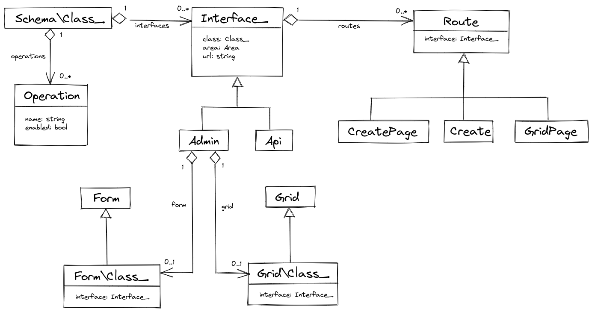
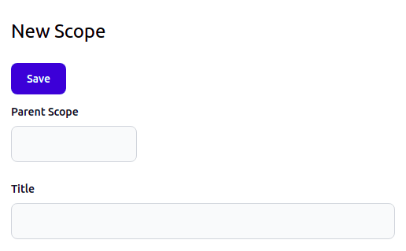

# 2021 Dec 06 - Dec 17

In Osm Admin, I've finished indexing. It means that whenever you modify an object in the database, the changes are automatically propagated to all dependent indexed properties in the database.  

I've also introduced a grid/form pair as the main user interface concept that is optimized for performing operations on multiple objects. There is also a programming interface (API) that will internally work in the same way, but without visuals. I implemented a part of this interface - an object creation form. 

Osm Framework and all projects built with it - including this website and Osm Admin - are upgraded to TailwindCSS 3.0.

More details:

{{ toc }}

### meta.abstract

In Osm Admin, I've finished indexing. It means that whenever you modify an object in the database, the changes are automatically propagated to all dependent indexed properties in the database.

I've also introduced a grid/form pair as the main user interface concept that is optimized for performing operations on multiple objects. There is also a programming interface (API) that will internally work in the same way, but without visuals. I implemented a part of this interface - an object creation form.

Osm Framework and all projects built with it - including this website and Osm Admin - are upgraded to TailwindCSS 3.0.

## Osm Admin v0.1.3

[Diff](https://github.com/osmphp/admin/compare/v0.1.2...v0.1.3)

### Approach

If you follow this project, you may have noticed a certain approach that is consistently applied to all parts of a project:

1. As an application developer, you define PHP classes and decorate them using some well-defined attributes. Actually it's enough to define just data structures your application operates with.

2. Osm Admin fetches these PHP classes into a data schema. The schema is designed in a way that is convenient to process in runtime. In fact, everything is a part of the schema: data classes, database table definitions, forms and their fields, grids and their columns.

3. There is a generic data handling, visual and programming interface implementation that just works.

4. There is a certain convention that allows you to define custom data processing logic, or visual interface logic, and your custom logic is used instead of standard one.

I use this approach on purpose. It will allow you to create your application quickly, and then tinker some little bits to make it even better.

### Indexing

Whenever you `insert()`, `update()` or `delete()` objects into/in/from a source table, the query trigger data change events. 

Events create notifications in the database about the changes. Then, the indexing engine runs one or more indexers that process data change notifications by updating all the objects that have properties computed based on the changed data.

Later, indexing will be done asynchronously, and you will be able to perform other operations not waiting for indexing to complete.

I wrote a [detailed article](06-data-indexing-3.md) about how to configure indexing, and how it actually works. The essential parts are visible in the following class diagram:

### Grid/Form Pairs

All the application data will be managed using grid/form visual pattern:

More about it [here](07-data-user-interface-for-managing-scopes.md).

### Interfaces

A grid/form pair will provide a visual interface for managing objects of a specific class (products, orders or customers).

Alternatively, there will be a programming interface - API - for performing the same operations from a script.

Both interfaces are designed to allow changing multiple objects with a single operation, similar to how `UPDATE ... WHERE ...` SQL statement works.

The following diagram catches the most important interface concepts:

For more details, read the whole piece about [interfaces](08-data-interfaces.md).  

### Forms

Speaking about forms, they will follow the same structure: form - chapter - section - fieldset - field:

 

A form will operate a bit differently depending on its mode - whether the user is creating a new object, modifying the existing one, or modifying several objects at once.

The form internal design is covered in a [dedicated article](09-data-forms.md).

The "create mode" of a form [is already implemented](15-data-object-creation-form.md):

  

## Osm Framework v0.14.2

[Diff](https://github.com/osmphp/core/compare/v0.13.22...v0.14.2)

There were two changes in Osm Framework:

* TailwindCSS upgraded to 3.0.
* Commit/rollback callbacks don't wait for outer transaction to be executed. 

## Osm Project v0.14.0

[Diff](https://github.com/osmphp/core/compare/v0.13.1...v0.14.0)

Updated to Osm Framework 0.14.

## *osm.software* Website v0.4.5

[Diff](https://github.com/osmphp/osmsoftware-website/compare/v0.4.4...v0.4.5)

### New Content

As indexing, compared to the initial design, has changed a lot, I wrote a detailed article in its actual inner workings. Also, I wrote a lot about grid/form visual interface concept and implementation efforts:

* [Indexing (3)](06-data-indexing-3.md)
* [User Interface For Managing Scopes](07-data-user-interface-for-managing-scopes.md)
* [Interfaces](08-data-interfaces.md)
* [Forms](09-data-forms.md)
* [Object Creation Form](15-data-object-creation-form.md)