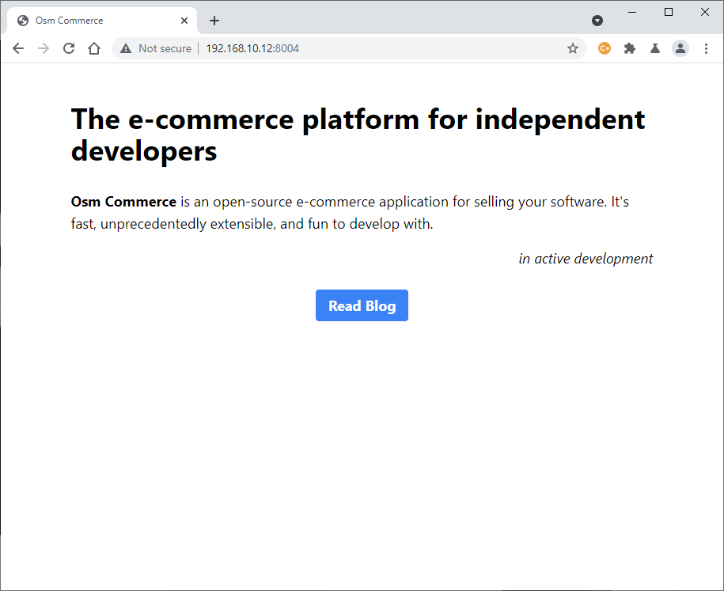

# Osm: Eagle (13) - `osmcommerce.com` home page

This is the third blog post in the series describing how `osmcommerce.com` was built. This post covers creating the project, and rendering the home page.

{{ toc }}

## My local setup

Locally, I "host" all the projects on a virtual Vagrant machine in order to make the development configuration as close to production as possible.

Unlike common Vagrant setup, I don't share any directories or files between virtual and real machines. I tried, but SMB was too slow, and NFS wasn't reliable with large amount of files.

If you use your real machine, or if your virtual and real machine share the project directory, omit the file sync steps in below sections.

## Starting a local project

After installing and configuring the [prerequisites](/todo):

1. On the virtual machine, run:

        cd {{ home_path }}

        # download the files
        composer create-project osmphp/framework-project {{ project_name }}
        cd {{ project_name}}
        npm install

        # compile the main app
        osmc Osm_App

        # build JS and CSS assets 
        gulp

        # starts the Web server on {{ http_port }} port
        php -S 0.0.0.0:{{ http_port }} -t public/Osm_App

2. Open <http://{{domain}}:{{http_port}}/> in the browser, you should see `Page not found` written with monospaced font. It's expected behavior - it means that the home page route is not defined yet.

3. On the virtual machine, run in a separate shell:

        cd {{ home_path }}/{{ project_name}}

        # watch the source files, and rebuild/recompile if needed 
        gulp watch

## Downloading project

Downloading a directory containing a lot of small files is known to be a slow operation, even from a virtual machine located on the same computer. It's a lot faster to archive, download and un-archive:

1. Archive the project files on the virtual machine:

        cd {{ home_path }}
        tar -czvf {{ project_name}}.tar.gz {{ project_name}}

2. Download the archive to the real machine.

3. Un-archive the project files on the real machine:

        cd {{ real_home_path }}
        tar -xzvf {{ project_name}}.tar.gz

## Configuring PhpStorm

Open the project in PhpStorm using `File -> New project from existing files`, and picking the last, `no Web server`, option, and configure it in `File -> Settings` as follows:

1. In `Build, ... -> Deployment`, add new deployment configuration, and map `{{ real_home_path }}\{{ project_name}}` to `{{ home_path }}/{{ project_name}}` in it.

2. In `Build, ... -> Deployment -> Options`, set `Upload changed files automatically = Always`, and tick `Delete remove files when local are deleted`.

3. In `Tools -> SSH Terminal`, set `SSH configuration` to the VM.

Finally, feed the PhpStorm with additional information for better code navigation. On the real machine, run:

    cd {{ real_home_path }}
    osmh Osm_App

## Creating the home page

1. There will be the home page, privacy policy page, and maybe more pages. Let's create a module that will handle them all. Create `src/Pages/Module.php`:

        <?php
        
        declare(strict_types=1);
        
        namespace My\Pages;
        
        use Osm\App\App;
        use Osm\Core\Attributes\Name;
        use Osm\Core\BaseModule;
        
        #[Name('pages')]
        class Module extends BaseModule
        {
            public static ?string $app_class_name = App::class;
        
            public static array $requires = [
                \My\Base\Module::class,
            ];
        }

2. Define a route for the home page in `src/Pages/Routes/Front/Home.php`:

        <?php
        
        declare(strict_types=1);
        
        namespace My\Pages\Routes\Front;
        
        use Osm\Core\Attributes\Name;
        use Osm\Framework\Areas\Attributes\Area;
        use Osm\Framework\Areas\Front;
        use Osm\Framework\Http\Route;
        use Symfony\Component\HttpFoundation\Response;
        use function Osm\view_response;
        
        #[Area(Front::class), Name('GET /')]
        class Home extends Route
        {
            public function run(): Response {
                return view_response('pages::home');
            }
        }

3. Create `themes/_front__tailwind/views/pages/home.blade.php`:

        <x-base::layout title='Osm Commerce'>
            <section class="col-span-12 py-12 grid grid-cols-6">
                <h1 class="col-span-6 lg:col-start-2 lg:col-span-4 text-2xl sm:text-4xl font-bold">
                    The e-commerce platform for independent developers
                </h1>
                

                    <strong>Osm Commerce</strong> is an open-source e-commerce application
                    for selling your software. It's fast, unprecedentedly extensible, and
                    fun to develop with.
                

                

                    in active development
                

                

                    <a class="bg-blue-500 hover:bg-blue-700 text-white font-bold py-2 px-4 rounded"
                        href="/todo" title="Read Blog"
                    >
                        Read Blog
                    </a>
                

            </section>
        </x-base::layout>

**Note**. The convention of marking non-existent links with `/todo` makes it easy to search the project, and find what's not implemented yet. 

The end result:

## See also

* [Applications and modules](/todo)
* [Module dependencies](/todo)
* [Compiling applications](/todo)
* [Creating a module](/todo)
* [Building application assets](/todo)
* [Watching application assets](/todo)
* [Using PHP Web server](/todo)
* [Areas and routes](/todo)
* [Creating a route](/todo)
* [Route responses](/todo)
* [Views](/todo)
* [Components](/todo)
* [Themes](/todo)
* [Tailwind theme](/todo)
